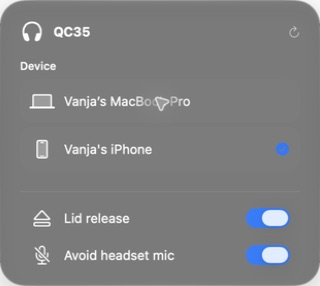

# QC35 for macOS

A macOS helper for QC35 headphones that stay connected after you close the lid or keep taking over your microphone.



This is an experimental source release of a personal utility. Open it from its Control Center tile; it does not add a separate menu-bar icon.

## What it does

- **Lid release:** closes the configured headset connection when the lid closes, all displays sleep, or the system begins sleeping. The helper never reconnects on wake.
- **Avoid headset mic:** restores a configured preferred microphone, with a configured fallback, while the headset is present. It does not remember an arbitrary previously selected microphone.
- **Device:** hands the headset to the chosen device. Mac selection routes sound to QC35 and releases the other source; phone selection confirms the phone connection before releasing the Mac. The rows are saved destinations, so disconnected devices remain available to select. One checkmark records the last verified handoff.
- **Control Center:** a WidgetKit control opens the companion app. Both switches persist locally and update the running helper.

The helper uses Core Audio, IOBluetooth, IOKit, and AppKit notifications. It has bounded retries and no periodic device polling. The companion uses SwiftUI, AppKit, WidgetKit, and App Intents. No third-party runtime dependencies are required.

## Requirements

The companion currently targets macOS 27 and builds with Xcode 27. The project generator uses Node.js with TypeScript stripping support (Node 22.18 or newer). Development and hardware observations were on Apple silicon with a Bose QC35 II; other Bose models are unverified.

## Build

From the repository root:

```sh
mkdir -p build
xcrun swiftc -O -warnings-as-errors QC35InputGuard.swift -o build/QC35InputGuard
node --experimental-strip-types ControlCenter/BuildProject.ts
xcodebuild -project ControlCenter/QC35.xcodeproj -scheme QC35 \
  -configuration Debug -derivedDataPath build/ControlCenter build
```

The app is produced at `build/ControlCenter/Build/Products/Debug/QC35.app`. The generated Xcode project uses local ad-hoc signing. This repository does not contain a notarized installer or distributable signed binary.

## Local setup

The helper and companion share `~/Library/Application Support/QC35InputGuard/config.json`. Create that directory, its `ControlCenter` subdirectory, and `~/Library/Logs/QC35InputGuard`, then copy `config.example.json` to `config.json` **only if no configuration already exists**. Set the exact headset and microphone names for your machine. The example microphone name is not universal.

```sh
build/QC35InputGuard status
build/QC35InputGuard prefer "Your microphone name"
build/QC35InputGuard option releaseOnSleep true
build/QC35InputGuard option avoidHeadsetMic true
build/QC35InputGuard watch
```

`status` reads live device state. `watch` runs the helper in the foreground; stop it with Control-C. Do not start a second watcher if you already installed a background instance. The companion's switches require a running helper to affect audio and lid behavior. This source release does not install or alter login services.

Install the built `QC35.app` in your Applications folder and launch it, then use macOS's Add Controls interface to add QC35 to Control Center. Pair the headset through macOS first. Opening the panel only queries an already-connected headset; connecting is an explicit device action.

An empty `visibleSourceAddresses` array shows all saved sources. To narrow the list, use addresses from the locally generated `ControlCenter/sources.json` cache. Keep that cache and your configuration private.

## Tests

These checks use fake devices and protocol fixtures; they do not change real audio, Bluetooth, or sleep state.

```sh
mkdir -p build/tests
cp QC35InputGuard.swift build/tests/main.swift
xcrun swiftc -O -warnings-as-errors -D QC35_TEST \
  build/tests/main.swift QC35ReleaseTests.swift -o build/tests/QC35ReleaseTests
build/tests/QC35ReleaseTests
xcrun swiftc -O -warnings-as-errors -parse-as-library -D BOSE_SOURCE_PROBE \
  ControlCenter/App/BoseSources.swift -o build/tests/BoseSourceProbe
build/tests/BoseSourceProbe --self-test
xcrun swiftc -swift-version 5 -warnings-as-errors -parse-as-library \
  -D QC35_HANDOFF_TEST ControlCenter/App/MacConnection.swift \
  ControlCenter/App/BoseSources.swift -o build/tests/QC35HandoffTests
build/tests/QC35HandoffTests
xcrun swiftc -swift-version 5 -warnings-as-errors -parse-as-library \
  -D QC35_MODEL_TEST ControlCenter/App/QC35Model.swift \
  ControlCenter/App/MacConnection.swift ControlCenter/App/BoseSources.swift \
  -o build/tests/QC35SelectionCacheTests
build/tests/QC35SelectionCacheTests
```

The current suite contains 31 policy/configuration tests, 21 offline protocol and selection checks, 13 native-operation lifecycle checks, and 3 selection-cache checks.

## Known limits

- Phone handoff has been verified by a fresh phone-connected status followed by confirmed Mac disconnection. Once the Mac is released, the panel retains the last verified destination because it cannot query the headset without reconnecting. This does not prove phone audio playback has started.
- The destination must have Bluetooth enabled and be reachable. Saved pairings are not proof that a device is currently online. The app does not turn on another device's Bluetooth, start its playback, or remove any pairing.
- Physical lid-close/sleep release and subsequent phone playback still need a hardware acceptance check.
- The popup uses Apple's regular Liquid Glass material for text legibility, with a single native `NSGlassEffectView` and no extra blur layer. Its appearance follows macOS settings and the content behind the panel.
- Apple's public Control Center API offers buttons and toggles. A custom expanded Control Center panel like Apple's Bluetooth UI is not exposed by the APIs used here.
- Release and microphone protection are reactive. macOS can briefly select the headset input before the helper responds, and an app that chooses its own input can bypass the default-input policy.
- Microphone protection waits if neither configured safe input is uniquely available. Releasing a Bluetooth connection is not proof that another device has begun playing audio.

## Source map

- `QC35InputGuard.swift`: event-driven microphone and connection-release helper.
- `QC35ReleaseTests.swift`: fake-device policy and configuration tests.
- `ControlCenter/App/`: companion UI, model, Mac connection, and Bose serial protocol.
- `ControlCenter/Widget/`: Control Center button.
- `ControlCenter/Shared/`: foreground App Intent.
- `ControlCenter/BuildProject.ts`: reproducible Xcode project generator.

Live configuration, device caches, logs, local deployment scripts, receipts, and binaries are excluded from this repository.

## Native API references

- [Core Audio default input](https://developer.apple.com/documentation/coreaudio/kaudiohardwarepropertydefaultinputdevice)
- [IOBluetooth connection release](https://developer.apple.com/documentation/iobluetooth/iobluetoothdevice/closeconnection())
- [WidgetKit controls](https://developer.apple.com/documentation/widgetkit/controls-collection)
- [Adopting Liquid Glass](https://developer.apple.com/documentation/technologyoverviews/adopting-liquid-glass)
- [NSPopover](https://developer.apple.com/documentation/appkit/nspopover)

This is an independent project, not an official Bose product.

## Protocol references

The Swift serial implementation was informed by the protocol layouts in [BoseConnect-Linux_based-connect](https://github.com/bosefirmware/BoseConnect-Linux_based-connect), a fork of Denton-L/based-connect published under GPLv3, and [aaronsb/bosectl](https://github.com/aaronsb/bosectl), published under the MIT license (copyright 2026 Aaron Bockelie). These references supplied packet framing, source-list/detail and connection message meanings, status values, and transport context. Protocol observations were then checked against a QC35 II. No external implementation is vendored in this repository.
